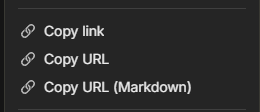

# Anytype links

Allow sharing Anytype objects via HTTP URLs

## [web](./web)

A simple URL ~~shortener~~ expander for anytype:// protocol

Demo: https://anytype-links.vercel.app

## [patcher](./patcher)

Patch for the Anytype Client to add additional buttons in object context menu

Instructions (do either): 
* [Download zip](https://anytype-links.vercel.app/patcher.zip), extract and run `patch.ps1`
* Clone this repo, run `cd patcher && npm install && npm run patch`

It works by default on Windows. For other platforms simply use 
`npm run patch --dir <ANYTYPE_DIR>` where `ANYTYPE_DIR` contains the Anytype executable.